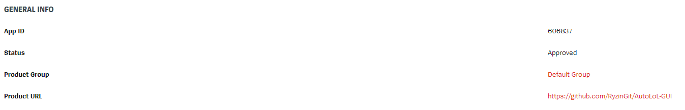

# AutoLoL-GUI
AutoLoL-GUI is Riot Games approved, non-API based automation software for League of Legends.

Bot will handle the match acceptance and champion selection process for you, even restarting itself if necessary, so you can take a break and let the bot handle everything while you relax.
##

##

## Features
- Enter up to 5 champion to pick
- Select if you want auto rune feature
- Enter up to 5 champion to ban
- Bot automatically accepts the match, picks and bans according to your preferences.
- Ability to restart itself if dodged while in champion selection screen
- Since software is approved by Riot Games and not breaking any terms of service, ensures that there is **no risk of ban**. This bot is designed to not interfere with game files or provide any in-game advantage to the user. You can use the bot with confidence, knowing that it will not compromise the integrity of the game or your account.
- The program is **open-source**, meaning that the source code is available for anyone to view and examine. This ensures the program is not malicious and allows for users to compile it using Python. The release version is created using Pyinstaller, which packages the program into a standalone executable and eliminates the need for additional downloads.
- **Enjoy your free time without waiting in front of the screen**

## Important Notes
- Since program is pixel based you require to use **1600x900** or **1280x720** client window size and **ENGLISH** or **TURKISH** client
- Beware of autofill
- If the system setting display scale is not set to 100%, the program will display an error message and instructions on how to change the setting.
- Windows is required

## Known Issues
- Avoid leaving the mouse cursor where the accept button will appear while searching for a match, as this may cause the program to not recognize the button.

## What could be implemented
- Push notification to phone
