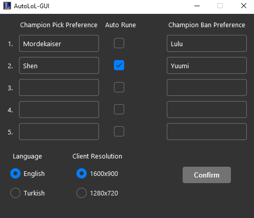

# LoLAutoPickBot
LoLAutoPickBot is non-API based automation software for League of Legends.

## Disclaimer
This software is not affiliated, associated, authorized, endorsed by, or in any way officially connected with the Riot Games, or any of its subsidiaries or its affiliates.

## Features
- Enter up to 5 champion to pick
- Select if you want auto rune feature
- Enter up to 5 champion to ban
- Bot automatically accepts the match, picks and bans according to your preferences.
- Ability to restart itself if dodged while in champion selection screen
- Enjoy your free time when you are not waiting in front of the screen

## Important Notes
- Since program is pixel based you require to use **1600x900** or **1280x720** client window size and **ENGLISH** or **TURKISH** client
- While the bot is running do not left your mouse where accept button will appear(I didn't find it right to keep the mouse fixed at the edges of the screen all the time.)
- Beware of autofill

## What could be implemented
- Push notification to phone
